<div align="center">
  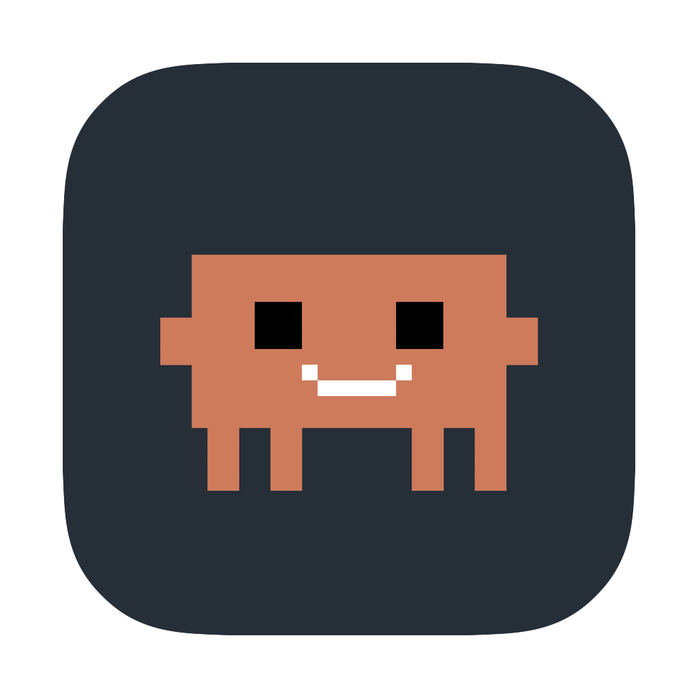
  <h1>Claude Pet 🦀</h1>
  <p><strong>Claw'd lives on your desktop and shows you what Claude Code is doing.</strong></p>
  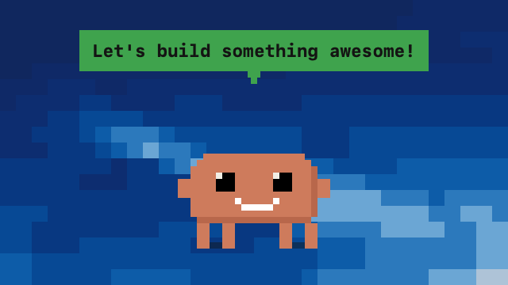
  <p><em>Every state, in order. Rendered from the sprite rig, not screen-recorded.</em></p>
</div>

## What it is

Claude Code tells you what it is doing inside the terminal. The moment you switch
to a browser, a design tool, or another repo, that goes dark — and if you run
several sessions at once, it was never visible in the first place.

Claude Pet puts it back where you can see it. Claw'd sits on the desktop, always
on top, and reflects your sessions continuously: what tool is running, what task
is in progress, which one just finished, and which one is stuck waiting on you.
No window to check, no tab to switch to. You just glance at him.

He floats above your windows, follows you across Spaces, and can be dragged
anywhere — including onto a second display. He watches **every** running Claude
Code session, mirrors whichever one is busiest, and clicking him opens a roster
of them all so you can pin one.

## The states

Each one is driven by something real on disk, and each says what it is reacting to.

<table>
<tr><td width="170">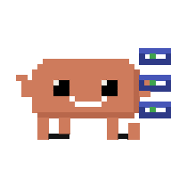</td><td>

### Working
A tool call is in flight. He picks up whatever he needs for the job — a scrolling
terminal, a hard hat, a server rack, a phone, glasses — and swaps it every twenty
seconds so a long task never looks frozen.

</td></tr>
<tr><td>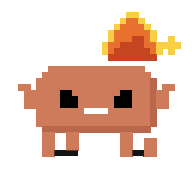</td><td>

### 🔥 Cooking
Claude is *going*. Triggered by **8+ tool calls in a minute**, or by **live
subagents** — the on-disk signature of an `ultracode` fan-out. His eyes narrow and
he catches fire.

*Why 8? Measured from real transcripts: an ordinary session runs a median of 4
tool calls a minute and a 90th percentile of 7, while a fanned-out workflow runs a
median of 22. Eight sits in the gap.*

</td></tr>
<tr><td>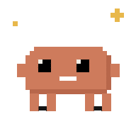</td><td>

### Thinking
Claude is reasoning — `thinking` blocks with no tool running. The bubble shows
three pulsing dots rather than words, because there is no honest label for that
moment and repeating the last thing he did would be a lie.

</td></tr>
<tr><td>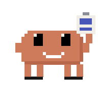</td><td>

### 👀 Nudging
A plan is written and Claude is blocked on **you**. Detected exactly: an
`ExitPlanMode` call with no answer yet. He holds out the plan, leans in, taps a
foot, and waits.

</td></tr>
<tr><td>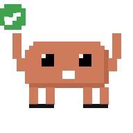</td><td>

### Done
A turn just ended. Arms up, green check, ✅ 🥳 🎉 — then he settles back to idle
after a few seconds, because finishing is a moment, not a status.

</td></tr>
<tr><td>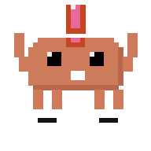</td><td>

### Needs you
A permission prompt is waiting. He waves both arms, bounces, and chirps. This is
the only state that gets to be loud, and the only one that needs hooks installed —
permission prompts are not written to the transcript.

</td></tr>
<tr><td></td><td>

### Idle
Sessions are live but Claude is between tasks. He cheers you on, and every so
often scrolls a status ticker instead — the model answering, how many sessions are
live, how long you have been coding today, the project and branch. Every few
seconds he does something unprompted: a jump, a stretch, a look around.

</td></tr>
<tr><td>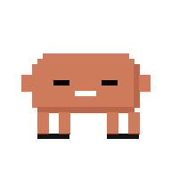</td><td>

### Asleep
Nothing is running. He breathes slowly with z's drifting up, and the render rate
drops so an idle pet costs an idle machine nothing.

</td></tr>
</table>

### Idle flourishes

Every seven seconds, one of six unprompted little things — picked per window and
played through as a shape rather than a frequency, so it never stutters halfway.

<table>
<tr>
  <td width="170" align="center">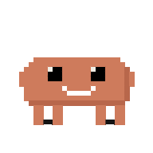<br><strong>Jump</strong></td>
  <td width="170" align="center">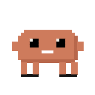<br><strong>Stretch</strong></td>
  <td width="170" align="center">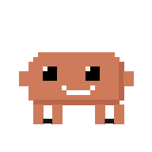<br><strong>Look around</strong></td>
</tr>
<tr>
  <td align="center">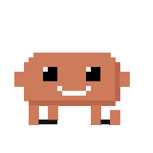<br><strong>Scuttle</strong></td>
  <td align="center">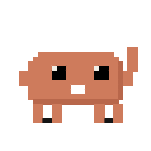<br><strong>Wave</strong></td>
  <td align="center">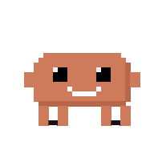<br><strong>Wiggle</strong></td>
</tr>
</table>

## Interactions

<table>
<tr><td width="170">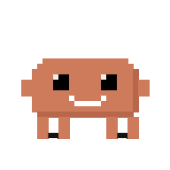<br></td><td>

### Hover him
He notices you and reacts — randomised between a **wink**, a **little jump**, a
**wave**, and a **wiggle**. Picked once per hover, so it holds for as long as you
stay. He stirs even when asleep.

</td></tr>
<tr><td></td><td>

### Click him
He squashes down, then the session roster opens. Drag him instead and the
reaction is suppressed — a click that moved him is a move.

Poke him three times quickly for something else. 🎉🪄

</td></tr>
<tr><td>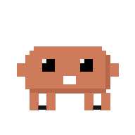</td><td>

### 🎉🪄 The party
Three quick pokes and he throws one. **Pose and colour both cycle** for four
seconds — cycling colour alone reads as a recolour, cycling the pose too reads as
a celebration — then he goes back to reporting reality.

</td></tr>
</table>

## The roster

Clicking him opens every live session at once: what each is doing, which project
it is in, and which one he is currently mirroring. Click a row to pin him to that
session; click it again to go back to following the busiest.

<div align="center">
  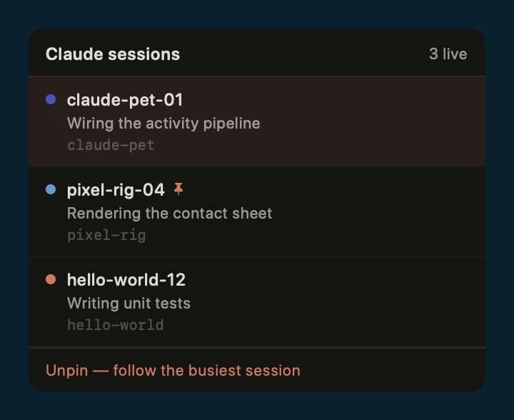
</div>

<p align="center"><em>These sessions are invented. The real panel lists your
actual project directories — which is exactly why the picture does not.</em></p>

## Installing

Download the **`.dmg`** from
[Releases](https://github.com/internetdialup/claude-pet/releases), open it, and
drag Claw'd to Applications.

> **First launch shows "unidentified developer".** This is expected. The app is
> ad-hoc signed and deliberately **not** notarized — notarizing would publish the
> author's legal name and Apple Team ID inside every copy. To open it:
>
> **Right-click the app → Open → Open.** Once only.
>
> Or, if you prefer the terminal:
> ```bash
> xattr -dr com.apple.quarantine /Applications/ClaudePet.app
> ```
>
> If you would rather not run someone else's binary at all — completely fair —
> [build it yourself](#building-it-yourself). It takes about thirty seconds.

**Claw'd has no Dock icon.** He lives in the menu bar: click the little crab
there for size, sounds, notifications, **Open at login**, session pinning, and
hook installation. He reappears wherever you last dragged him, on whichever
display you left him on.

## Building it yourself

```bash
git clone https://github.com/internetdialup/claude-pet.git
cd claude-pet
./run.sh
```

That builds the executable, assembles `build/ClaudePet.app`, ad-hoc signs it, and
launches it. Requires macOS 14+ and a Swift 6 toolchain (Xcode 16 or newer).

```bash
swift build --product ClaudePet    # the Build Target from AGENT.md
swift test                          # unit tests; synthetic fixtures, never touches ~/.claude/
./scripts/make-icon.sh              # regenerate the app icon from the sprite rig
./scripts/make-dmg.sh               # build the installer
```

Three offline modes are useful when working on it:

```bash
.build/debug/ClaudePet --render-sheet out.png   # contact sheet of every mood and prop
.build/debug/ClaudePet --render-gif docs/media  # the GIFs above
.build/debug/ClaudePet --probe                  # print the PetState from your real sessions
.build/debug/ClaudePet --probe 320               # ...after watching for 320s, past the decay horizons
.build/debug/ClaudePet --render-marketing out/  # large transparent stills and loops
```

## 🗣️ Make him say your words

Everything Claw'd says lives in **two files** — no strings scattered through the
codebase, no localisation framework, no config format to learn:

| | File | Holds |
| :---: | :--- | :--- |
| 💬 | [`Support/vocab.swift`](Sources/ClaudePet/Support/vocab.swift) | What he says in the **speech bubble** |
| 🔔 | [`Support/notification-nudge.swift`](Sources/ClaudePet/Support/notification-nudge.swift) | What the **macOS banners** say |

Both are the same shape — an exhaustive `switch` returning `[String]` — so
learning one teaches the other. Edit the arrays, run `./run.sh`, and he says
your words instead.

| | Occasion | When he says it | Ships with |
| :---: | :--- | :--- | :--- |
| 💬 | `.idle` | Sessions are live but Claude is between tasks | *"Let's build something awesome!"* · *"Ooo that's a spicy idea 🌶️"* |
| 💭 | `.thinking` | Reasoning, no tool running | *"Thinking it through"* · *"Give me a second"* |
| ⚙️ | `.working` | A tool is in flight | *"On it"* · *"This is the fun part"* |
| 🔥 | `.cooking` | Going hard — rapid calls, or a subagent fan-out | *"Absolutely cooking 🔥"* · *"Do not disturb"* |
| 👀 | `.planReady` | A plan is up and he wants your verdict | *"Plan's ready 👀"* · *"Shall we?"* |
| ✅ | `.finished` | A turn just ended | *"Nailed it"* · *"That's a wrap 🎬"* · *"Chef's kiss"* |
| ‼️ | `.needsYou` | Claude is blocked on you — usually a permission prompt | *"Psst — I need you"* · *"One quick question"* |
| 😴 | `.sleeping` | Nothing is running at all | *"zzz…"* · *"Resting my claws"* |

### 🥇 What wins, when several could apply

This is the one thing worth reading before you edit, because otherwise it looks
like your lines are being ignored:

| | Precedence | Example |
| :---: | :--- | :--- |
| 1️⃣ | A **rule** matching the current task | `git commit …` → *"Committing the good stuff 📦"* |
| 2️⃣ | The **real task text**, whenever there is one | *"Running the test suite"* |
| 3️⃣ | The **state's lines** | *"This is the fun part"* |

Rank 2️⃣ is deliberate: while Claude is actually running something, the bubble
shows what it is running. A pet that hides *"Running the test suite"* behind a
joke is a worse pet. So your `.working` and `.cooking` lines fill the **gaps
between tools** rather than replacing anything useful, and `.sleeping` speaks
only occasionally — a sleeping pet that talks constantly is not asleep.

### ✏️ Editing lines

Find the occasion, change the strings. That is the whole job:

```swift
// 💬 Between tasks. Encouragement, mostly.
case .idle: [
    "Let's build something awesome!",
    "Now we're cooking with crisco 🍳",
    "your line here",          // ← add as many as you like
]
```

### 🎯 Custom sentences for particular work

Rules let him say something specific when the task matches a pattern. The first
match wins, so put the specific ones first:

```swift
public static let rules: [VocabRule] = [
    VocabRule(#"\btest(s|ing)?\b"#, [
        "Writing tests, the good kind 🧪",
        "Red, green, refactor",
    ]),
    VocabRule(#"\bdeploy\b"#, ["Shipping it 🚀"]),   // ← yours here
]
```

| | Ships with | Fires on |
| :---: | :--- | :--- |
| 🧪 | tests | `test`, `tests`, `testing` |
| 📦 | commits | `commit`, `git` |
| 🔍 | debugging | `fix`, `bug`, `debug` |
| 📝 | docs | `README`, `doc`, `docs`, `document` |

Patterns are case-insensitive regular expressions. **A pattern that doesn't
compile is skipped, not fatal** — a typo in your vocabulary should never take
the pet down.

### ➕ Adding a whole new occasion

Add a `case` to `ShoutoutOccasion` and **the build will fail until you give it
lines**. That is deliberate — `lines(for:)` is a `switch`, not a dictionary, so
the compiler catches a half-added occasion instead of Claw'd silently saying
nothing at runtime.

### 📏 Two rules worth knowing

| | |
| :--- | :--- |
| **Keep it short** | The bubble cuts off at **29 characters** — it caps at 210pt, the font advances 6.62pt per character, and 194 ÷ 6.62 ≈ 29. A test enforces it. |
| **Emoji are welcome** | They render fine — but count each as **two** characters, since they draw about twice as wide. 🍳 🌶️ 🎬 all ship by default. |
| **He deals a deck** | Lines are dealt like a shuffled deck: every line is used once before any repeats, and the shuffle is reseeded each pass. A plain random pick would show one line four times and another never. |

<div align="center">
  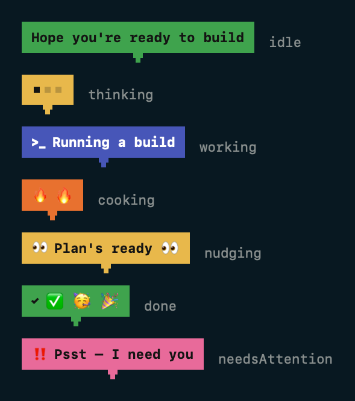
</div>

<p align="center"><em>One bubble per state. The fill, the glyph and the text all
come from the two files above.</em></p>

### 🔔 What the banners say

Same idea, second file. `notification-nudge.swift` holds the title and body for
each banner, and Claw'd's own icon rides along with it:

| | Event | Fires when | Default |
| :---: | :--- | :--- | :---: |
| ✅ | `.finished` | A turn ends while you are looking elsewhere | **on** |
| ‼️ | `.needsYou` | Claude is blocked on you | **on** |
| 👀 | `.planReady` | A plan is waiting for approval | **on** |
| 🔥 | `.cooking` | A session starts really going | **off** |

`.cooking` ships off because it fires often; turn it on from the menu bar under
**Notify when cooking 🔥**. All four respect the master **Notifications** toggle.

Banner copy has a tighter budget than the bubble: **titles under 40 characters,
bodies under 80**, because macOS truncates. The session name is appended for
you, so don't repeat it. A test enforces both limits.

Selection is driven by a **seed, never `random()`** — the bubble is recomputed on
a timer, so a real RNG would rewrite the sentence out from under you mid-read.

## How it knows

Claude Code already writes everything needed, and the pet only reads it:

| Source | What it gives |
| :--- | :--- |
| `~/.claude/sessions/<pid>.json` | Live session registry. The filename is the PID, so liveness is `kill(pid,0)` **plus** a `procStart` match to guard PID reuse. |
| `~/.claude/projects/<encoded-cwd>/<id>.jsonl` | The transcript. `tool_use` blocks give the running tool and its description; `thinking` blocks and `stop_reason` give the rest. Also the model and git branch. |
| `~/.claude/tasks/<id>/*.json` | Todos. The in-progress item's `activeForm` is already phrased for a human, so it wins the bubble. |
| Hooks (optional) | `PreToolUse` / `PostToolUse` / `Stop` / `Notification` for sub-100ms reactions, and the only way to see a permission prompt. |

Filesystem watching is the ground truth; hooks are a latency optimisation on top.
That ordering is deliberate — hooks are blind to sessions that started before
they were installed, so the pet has to be correct without them.

### About the usage percentages

While idle, Claw'd rotates encouragement with a status ticker: the model
answering, how many sessions are live, how long you have been coding today, and
the project and branch.

**The weekly and 5-hour usage lines will probably not appear.** Claude Code no
longer publishes rate-limit percentages to disk, and this app will not invent a
number it cannot measure. The code reads the usage cache and freshness-gates it,
so those lines light up on their own if the data ever comes back. An empty line
is the honest answer; a made-up percentage is not.

## What it will not do

`~/.claude/` is your live working data. The rules are in `Bamboo.md` §5 and §6:

- **Read-only** for everything Claude Code owns — sessions, transcripts, todos,
  settings. The pet writes in exactly two places, neither of which is Claude's
  data: its own event drop-directory `~/.claude/claude-pet-events/`, and the hook
  installer, which is user-initiated from the menu bar, shows you the exact
  change first, and copies `settings.json` to `settings.json.bak.<timestamp>`
  before writing.
- **Every read is a bounded tail.** Transcripts reach 85 MB; a full read is a
  hang, not a slow path.
- **No network. At all.** `Package.swift` has an empty `dependencies` array,
  which makes that checkable rather than promised. Nothing is uploaded, no
  telemetry, no analytics, no crash reporting.
- Tests never touch `~/.claude/`.

## The art

Claw'd is Anthropic's mascot. He is **drawn, not imported** — a parametric rig
rasterised into a 32×32 indexed buffer each frame
([`Sources/ClaudePet/View/`](Sources/ClaudePet/View/)). Flat colour, no outline,
no shading ramp, whole-pixel motion. He is not a sprite sheet, so a new pose is a
few numbers rather than a new asset, and the app icon is rendered from the same
rig so the two can never drift apart.

<div align="center">
  
</div>

<p align="center"><em>Every prop, from the same rig — no sprite sheet anywhere.</em></p>

This project is unofficial and not affiliated with or endorsed by Anthropic. See
[LICENSE](LICENSE).

## Version history

See [CHANGELOG.md](CHANGELOG.md). Currently **v1.3.0**.

## Contributing

The repo follows Bamboo, a governance discipline for AI-assisted codebases. Start
at [`AGENT.md`](AGENT.md), then [`Bamboo.md`](Bamboo.md), then
[`docs/ctx-orientation.md`](docs/ctx-orientation.md) for why things are the way
they are. [`development/swift-development.md`](development/swift-development.md)
is the structural standard for the Swift itself.

Two rules worth knowing before you open a PR:

1. **Exit codes are the evidence.** "It builds" needs `swift build` exiting 0.
2. **Never read a transcript whole.** Bounded tails only.

MIT licensed.
