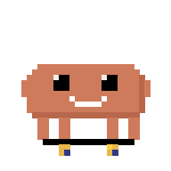

<div align="center">
  
  <h1>Claude Pet 🦀</h1>
  <p><strong>Claw'd sits on your desktop and shows you what Claude Code is doing.</strong></p>
  
  <p><em>Every state, in order. Rendered from the sprite rig, not screen-recorded.</em></p>
  <p>
    <a href="https://github.com/internetdialup/claude-pet/releases/latest"><strong>⬇️ Download for macOS</strong></a>
    &nbsp;·&nbsp; <a href="#-build-him-yourself">Build it yourself</a>
    &nbsp;·&nbsp; <a href="#-what-he-never-does">What he never does</a>
  </p>
</div>

## 🙈 The moment you switch windows, Claude goes dark

Claude Code tells you what it is doing inside the terminal. Switch to a browser,
a design tool, or another repo and that goes away — and if you run several
sessions at once, it was never visible in the first place.

Claw'd puts it back where you can see it. He sits on the desktop, always on top,
and reflects your sessions continuously: which tool is running, what task is in
progress, which one just finished, and which one is stuck waiting on you. No
window to check, no tab to switch to. You glance at him.

He watches **every** running session, mirrors whichever is busiest, and clicking
him opens a roster of them all.

## 🦀 Eight states, and every one is reading something real

<table>
<tr>
  <td width="150" align="center"><br><strong>Working</strong><br><sub>a tool call is in flight</sub></td>
  <td width="150" align="center"><br><strong>🔥 Cooking</strong><br><sub>8+ tool calls a minute</sub></td>
  <td width="150" align="center"><br><strong>Thinking</strong><br><sub>reasoning, no tool</sub></td>
  <td width="150" align="center"><br><strong>👀 Nudging</strong><br><sub>a plan awaits you</sub></td>
</tr>
<tr>
  <td align="center"><br><strong>Done</strong><br><sub>a turn just ended</sub></td>
  <td align="center"><br><strong>Needs you</strong><br><sub>blocked on a prompt</sub></td>
  <td align="center"><br><strong>Idle</strong><br><sub>between tasks</sub></td>
  <td align="center"><br><strong>Asleep</strong><br><sub>nothing running</sub></td>
</tr>
</table>

None of these are decorative. **Cooking** fires on 8+ tool calls a minute or a
live subagent fan-out — 8 because a measured ordinary session runs a median of 4
and a 90th percentile of 7, while a fanned-out one runs 22. **Nudging** is an
exact `ExitPlanMode` with no answer yet. **Thinking** shows three dots rather
than words, because there is no honest label for that moment.

## ✨ Nine things he does when nobody asked

<table>
<tr>
  <td width="150" align="center"><br><strong>Jump</strong></td>
  <td width="150" align="center"><br><strong>Stretch</strong></td>
  <td width="150" align="center"><br><strong>Look around</strong></td>
  <td width="150" align="center"><br><strong>Scuttle</strong></td>
</tr>
<tr>
  <td align="center"><br><strong>Wave</strong></td>
  <td align="center"><br><strong>Wiggle</strong></td>
  <td align="center"><br><strong>Kickflip</strong></td>
  <td align="center"><br><strong>Varial flip</strong></td>
</tr>
</table>

On a seven-second cycle, but only about seven cycles in ten fire — so the gaps
stay irregular and he is still most of the time. Land a trick and he says
something about it. While he waits he also shares what he knows: **76 fun facts**
across computer science, AI and Claude, plus **16 tips** about Claude Code
itself, every one checked against the installed build rather than the docs.

## 👋 He notices you

<table>
<tr><td width="150"><br></td><td>

**Hover him** and he reacts — a wink, a little jump, a wave or a wiggle, picked
once per hover so it holds while you stay. He stirs even when asleep.

**Click him** and he squashes down, then the roster opens. **Press and hold** to
pet him and hearts rise. **Poke him three times quickly** for something else. 🎉🪄

**Drag him** anywhere, including onto a second display — he remembers where.

</td></tr>
</table>

## 📋 Every session at once

<div align="center">
  
</div>

<p align="center"><em>These sessions are invented. The real panel lists your
actual project directories — which is exactly why the picture does not.</em></p>

Click a row to pin him to that session; click again to go back to following the
busiest. Summon a **second pet** from the menu bar and the two park beside each
other without their speech bubbles ever overlapping.

## 🗣️ Make him say your words

Everything Claw'd says lives in **one file** — no strings scattered through the
codebase, no config format to learn. Open
[`Sources/ClaudePet/Support/vocab.swift`](Sources/ClaudePet/Support/vocab.swift),
change the strings, rebuild:

```swift
// 💬 Between tasks. Encouragement, mostly.
case .idle: [
    "Let's build something awesome!",
    "your line here",          // ← add as many as you like
]
```

Rules let him say something specific when a task matches a pattern — a commit
joke for `git commit`, your own line for `deploy`. Keep lines under **28
characters** and they sit still; longer ones scroll past as a ticker.

**→ [The full guide to writing his lines](docs/writing-his-lines.md)**

## ⬇️ Get him on your desktop

**[Download the latest `.dmg`](https://github.com/internetdialup/claude-pet/releases/latest)**,
open it, drag Claw'd to Applications.

**Requires macOS 14 or later on Apple silicon.** There is no Intel build.

> **First launch says "unidentified developer".** That is expected, and
> deliberate: notarizing would publish the author's legal name and Apple Team ID
> inside every copy. The one command that works on every version of macOS:
>
> ```bash
> xattr -dr com.apple.quarantine /Applications/ClaudePet.app
> ```
>
> Prefer the UI? Open it once, dismiss the warning, then **System Settings →
> Privacy & Security → Open Anyway**. On macOS 14 you can right-click → **Open**
> instead; macOS 15 removed that shortcut.
>
> Rather not run someone else's binary? Entirely fair —
> [build it yourself](#-build-him-yourself), it takes about thirty seconds.

**Claw'd has no Dock icon.** He lives in the menu bar: click the little crab
there for size, sounds, **Open at login**, costumes, session pinning, a second
pet, and hook installation.

## 🔒 What he never does

This app reads your live Claude Code session data. That earns you a specific
account of what it does with it, not a privacy badge.

- **No network. At all.** There is no `URLSession`, no socket, no analytics, no
  update check, and zero dependencies. Verifiable in one grep — which is most of
  why this repo is public.
- **Read-only on everything Claude Code owns.** He never writes to `sessions/`,
  `projects/` or `tasks/`. The file watcher opens with `O_EVTONLY`, a descriptor
  that *cannot* write.
- **He never reads a transcript whole.** A bounded tail off the end. Measured on
  a 92 MB file: 21 events in 0.006s, 426 KB of memory.
- **One writer, and you press it.** "Install Claude hooks…" is the only thing
  that touches `settings.json`. It backs up first, merges without destroying
  your existing hooks, preserves file permissions, and refuses rather than
  resets if the file will not parse.
- **Nothing leaves your machine**, because nothing can.

## 🔨 Build him yourself

```bash
git clone https://github.com/internetdialup/claude-pet.git
cd claude-pet
./run.sh
```

That builds the executable, assembles `build/ClaudePet.app`, ad-hoc signs it and
launches it. Requires macOS 14+ on Apple silicon and a Swift 6 toolchain
(Xcode 16.4 or newer). No package manager, no dependencies.

## 📚 More

| | |
| :--- | :--- |
| 🗣️ | [Writing his lines](docs/writing-his-lines.md) — the vocabulary, rules and banner copy |
| 🔍 | [How he knows](docs/how-he-knows.md) — what on disk drives each state |
| 🎨 | [The art](docs/the-art.md) — one 32×32 rig, no sprite sheets |
| 📋 | [Changelog](CHANGELOG.md) |
| 🤝 | [Contributing](CONTRIBUTING.md) |

---

<div align="center">
  
  <p><em>Every prop, from the same rig — no sprite sheet anywhere.</em></p>
  <p>Unofficial, and not affiliated with or endorsed by Anthropic.<br>
  MIT — see <a href="LICENSE">LICENSE</a>; trademark note in <a href="NOTICE.md">NOTICE.md</a>.</p>
</div>
