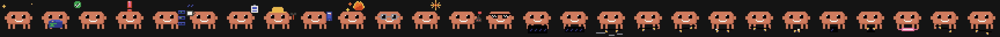

# The art

Claw'd is Anthropic's mascot, and in this app he is **drawn in code**: a
parametric rig rasterised into a 32×32 indexed buffer every frame
([`Sources/ClaudePet/View/`](Sources/ClaudePet/View/)). Flat colour, no
outline, no shading ramp, whole-pixel motion. There is no sprite sheet, so a
new pose is a few numbers instead of a new asset. The app icon renders from
the same rig, so the two can never drift apart.

  

<em>Every prop, from the same rig. No sprite sheet anywhere.</em>

This project is unofficial and not affiliated with or endorsed by Anthropic.
MIT — see [LICENSE](LICENSE); the trademark and character-design note is in
[NOTICE.md](NOTICE.md).

---

[← Back to the README](../README.md)
